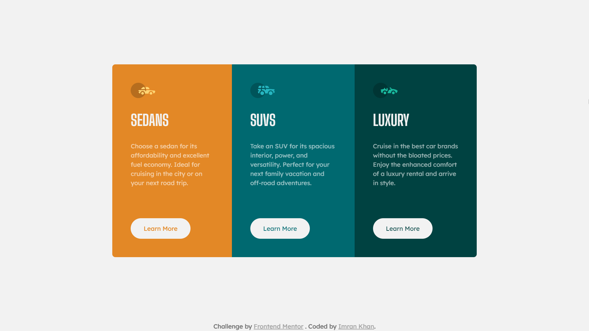

# Frontend Mentor - 3-column preview card component solution

This is a solution to the [3-column preview card component challenge on Frontend Mentor](https://www.frontendmentor.io/challenges/3column-preview-card-component-pH92eAR2-). Frontend Mentor challenges help you improve your coding skills by building realistic projects.

## Table of contents

- [Overview](#overview)
  - [The challenge](#the-challenge)
  - [Screenshot](#screenshot)
  - [Links](#links)
- [My process](#my-process)
  - [Built with](#built-with)
  - [What I learned](#what-i-learned)
  - [Useful resources](#useful-resources)
- [Author](#author)

## Overview

### The challenge

Users should be able to:

- View the optimal layout depending on their device's screen size
- See hover states for interactive elements

### Screenshot

### Links

- [Solution](./)
- [Live Site](https://astr0n0mer.github.io/challenges-frontendmentor.io/3-column-preview-card-component/index.html)

## My process

### Built with

- Semantic HTML5 markup
- CSS custom properties
- Flexbox
- Mobile-first workflow

### What I learned

Used the following pseudo selectors and classes:

- Pseudo class: `:hover`
- Pseudo selectors: `::before`, `::after`

### Useful resources

One article per day from [css-tricks](https://css-tricks.com/) is helping me to expand my knowledge with frontend technologies

## Author

- Github - [astr0n0mer](https://www.github.com/astr0n0mer)
- Frontend Mentor - [@astr0n0mer](https://www.frontendmentor.io/profile/astr0n0mer)
- Twitter - [@astronomer404](https://www.twitter.com/astronomer404)
