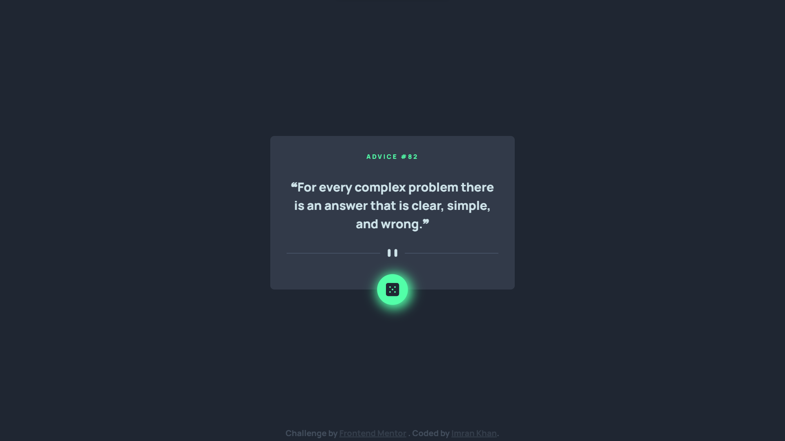

# Frontend Mentor - Advice generator app solution

This is a solution to the [Advice generator app challenge on Frontend Mentor](https://www.frontendmentor.io/challenges/advice-generator-app-QdUG-13db). Frontend Mentor challenges help you improve your coding skills by building realistic projects.

## Table of contents

- [Overview](#overview)
  - [The challenge](#the-challenge)
  - [Screenshot](#screenshot)
  - [Links](#links)
- [My process](#my-process)
  - [Built with](#built-with)
  - [What I learned](#what-i-learned)
  - [Continued development](#continued-development)
- [Author](#author)

**Note: Delete this note and update the table of contents based on what sections you keep.**

## Overview

### The challenge

Users should be able to:

- View the optimal layout for the app depending on their device's screen size
- See hover states for all interactive elements on the page
- Generate a new piece of advice by clicking the dice icon

### Screenshot

| Mobile                       | Desktop                       |
| ---------------------------- | ----------------------------- |
|  |  |

### Links

- [Solution](./)
- [Live Site](https://astr0n0mer.github.io/challenges-frontendmentor.io/advice-generator-app/index.html)

## My process

### Built with

- Semantic HTML5 markup
- CSS custom properties
- Flexbox
- Mobile-first workflow
- Javascript

### What I learned

- Learned to manipulate the DOM using Javascript
- Implemented and used custom events for some HTML elements

### Continued development

I should start learning Javascript as I will be moving towards intermediate level projects from now.

## Author

- Github - [astr0n0mer](https://www.github.com/astr0n0mer)
- Frontend Mentor - [@astr0n0mer](https://www.frontendmentor.io/profile/astr0n0mer)
- Twitter - [@astronomer404](https://www.twitter.com/astronomer404)
