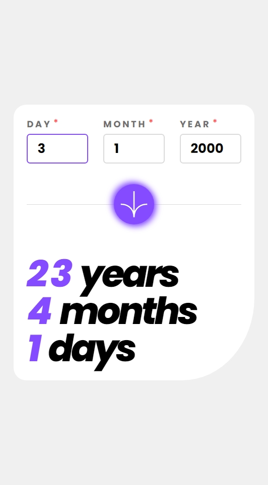
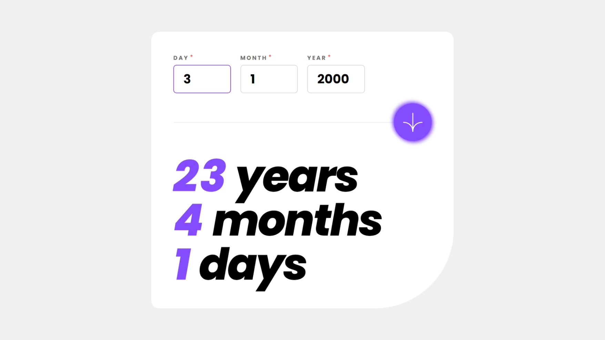

# Frontend Mentor - Age calculator app solution

This is a solution to the [Age calculator app challenge on Frontend Mentor](https://www.frontendmentor.io/challenges/age-calculator-app-dF9DFFpj-Q). Frontend Mentor challenges help you improve your coding skills by building realistic projects.

## Table of contents

- [Overview](#overview)
  - [The challenge](#the-challenge)
  - [Screenshot](#screenshot)
  - [Links](#links)
- [My process](#my-process)
  - [Built with](#built-with)
  - [What I learned](#what-i-learned)
  - [Useful resources](#useful-resources)
- [Author](#author)

## Overview

### The challenge

Users should be able to:

- View an age in years, months, and days after submitting a valid date through the form
- Receive validation errors if:
  - Any field is empty when the form is submitted
  - The day number is not between 1-31
  - The month number is not between 1-12
  - The year is in the future
  - The date is invalid e.g. 31/04/1991 (there are 30 days in April)
- View the optimal layout for the interface depending on their device's screen size
- See hover and focus states for all interactive elements on the page
- **Bonus**: See the age numbers animate to their final number when the form is submitted

### Screenshot

| Mobile                              | Desktop                              |
| ----------------------------------- | ------------------------------------ |
|  |  |

### Links

- [Solution](./)
- [Live Site](https://astr0n0mer.github.io/challenges-frontendmentor.io/age-calculator-app/dist/index.html)

## My process

### Built with

- [Vite](https://vitejs.dev/)
- [React](https://react.dev/)
- [Styled Components](https://styled-components.com/)
- Semantic HTML5 markup
- Flexbox
- CSS Grid
- Mobile-first workflow

### What I learned

- Learned the use of `useState()` hook to maintain state values accross renders in React
- Used `styled components` to group markup, styling and logic in a single component

### Useful resources

- [useState()](https://react.dev/reference/react/useState)
- [Complete Guide On How To Use Styled-components In React | Dev.to](https://dev.to/elijahtrillionz/complete-guide-on-how-to-use-styled-components-in-react-360c)

## Author

- Portfolio - [Imran Khan](https://imrank.vercel.app/)
- GitHub - [astr0n0mer](https://www.github.com/astr0n0mer)
- Frontend Mentor - [astr0n0mer](https://www.frontendmentor.io/profile/astr0n0mer)
- Twitter - [imrank404](https://www.twitter.com/imrank404)
