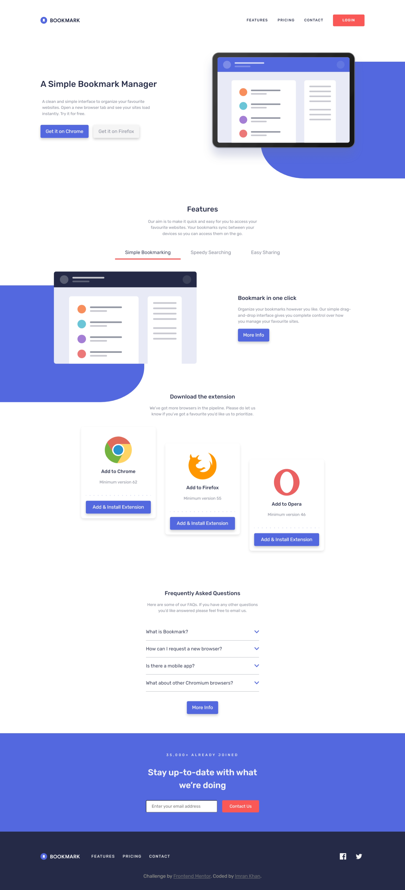

# Frontend Mentor - Bookmark landing page solution

This is a solution to the [Bookmark landing page challenge on Frontend Mentor](https://www.frontendmentor.io/challenges/bookmark-landing-page-5d0b588a9edda32581d29158). Frontend Mentor challenges help you improve your coding skills by building realistic projects.

## Table of contents

- [Overview](#overview)
  - [The challenge](#the-challenge)
  - [Screenshot](#screenshot)
  - [Links](#links)
- [My process](#my-process)
  - [Built with](#built-with)
  - [What I learned](#what-i-learned)
  - [Continued development](#continued-development)
  - [Useful resources](#useful-resources)
- [Author](#author)

## Overview

### The challenge

Users should be able to:

- View the optimal layout for the site depending on their device's screen size
- See hover states for all interactive elements on the page
- Receive an error message when the newsletter form is submitted if:
  - The input field is empty
  - The email address is not formatted correctly

### Screenshot

| Mobile                       | Desktop                       |
| ---------------------------- | ----------------------------- |
|  |  |

### Links

- [Solution](./)
- [Live Site](https://astr0n0mer.github.io/challenges-frontendmentor.io/bookmark-landing-page/index.html)

## My process

### Built with

- Semantic HTML5 markup
- CSS custom properties
- Flexbox
- CSS Grid
- Mobile-first workflow

### What I learned

- Used CSS combinators along with `:nth-of-type(n)` selector to switch elements' visibility on user interaction.
- The above approach used hidden `<input />` elements of type radio and checkbox.
- This eliminated the need to hook up elements in JavaScript and toggle visibility classes.

```html
<input type="checkbox" id="nav-mobile-checkbox" class="d-none" />

<input
  type="radio"
  name="feature--selected"
  id="simple-bookmarking"
  class="d-none"
  checked
/>
<input
  type="radio"
  name="feature--selected"
  id="speedy-searching"
  class="d-none"
/>

<input type="checkbox" id="what-is-bookmark" class="d-none" />
<input type="checkbox" id="how-can-i-request-a-new-browser" class="d-none" />
```

```scss
#nav-mobile-checkbox:checked + .nav-mobile {
  z-index: 3;
  opacity: 0.95;
  scale: 1;
}

.feature-wrapper {
  @for $i from 1 through 3 {
    input[name="feature--selected"]:nth-of-type(#{$i}):checked {
      & ~ .feature-list {
        .feature__label:nth-of-type(#{$i}) {
          color: var(--clr-text-primary);

          &::after {
            background-color: var(--accent-secondary);
          }
        }
      }

      & ~ .feature-tab-wrapper {
        .feature:nth-of-type(#{$i}) {
          position: static;
          transform: translateX(0);
          opacity: 1;
        }
      }
    }
  }
}

@for $i from 1 through 4 {
  input[type="checkbox"]:nth-of-type(#{$i}):checked {
    & ~ .question:nth-of-type(#{$i}) {
      svg {
        rotate: 180deg;
        path {
          stroke: var(--accent-secondary);
        }
      }

      .answer {
        opacity: 1;
        margin: 1em auto;
        max-height: fit-content;
      }
    }
  }
}
```

### Continued development

- Need to dive deeper into CSS transitions and animations to make my projects more interactive.
- Need to explore more into CSS pseudo selectors & classes to improve my styling.

### Useful resources

- [:nth-of-type() | mdn web docs\_](https://developer.mozilla.org/docs/Web/CSS/:nth-of-type)
- [CSS Combinators | mdn web docs\_](https://developer.mozilla.org/docs/Learn/CSS/Building_blocks/Selectors/Combinators)

## Author

- Github - [astr0n0mer](https://www.github.com/astr0n0mer)
- Frontend Mentor - [@astr0n0mer](https://www.frontendmentor.io/profile/astr0n0mer)
- Twitter - [@astronomer404](https://www.twitter.com/astronomer404)
