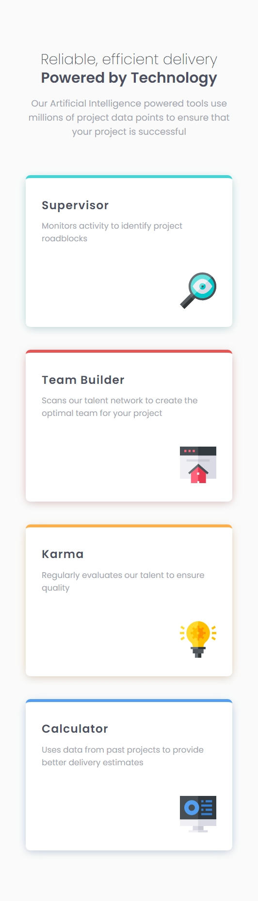
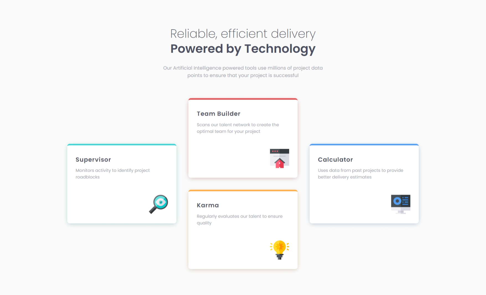

# Frontend Mentor - Four card feature section solution

This is a solution to the [Four card feature section challenge on Frontend Mentor](https://www.frontendmentor.io/challenges/four-card-feature-section-weK1eFYK). Frontend Mentor challenges help you improve your coding skills by building realistic projects.

## Table of contents

- [Overview](#overview)
  - [The challenge](#the-challenge)
  - [Screenshot](#screenshot)
  - [Links](#links)
- [My process](#my-process)
  - [Built with](#built-with)
  - [What I learned](#what-i-learned)
  - [Useful resources](#useful-resources)
- [Author](#author)

## Overview

### The challenge

Users should be able to:

- View the optimal layout for the site depending on their device's screen size

### Screenshot

| Mobile                              | Desktop                              |
| ----------------------------------- | ------------------------------------ |
|  |  |

### Links

- [Solution](./)
- [Live Site](https://astr0n0mer.github.io/challenges-frontendmentor.io/four-card-feature-section/index.html)

## My process

### Built with

- [Vite](https://vitejs.dev/)
- [React](https://react.dev/)
- [SASS/SCSS](https://sass-lang.com/)
- Semantic HTML5 markup
- CSS custom properties
- CSS Grid
- Mobile-first workflow

### What I learned

- Created my first project using React JS
- Learned component-based development
- Learned the usage of props in React

### Useful resources

- [Learn React](https://react.dev/learn/describing-the-ui)

## Author

- GitHub - [astr0n0mer](https://www.github.com/astr0n0mer)
- Frontend Mentor - [@astr0n0mer](https://www.frontendmentor.io/profile/astr0n0mer)
- Twitter - [@astronomer404](https://www.twitter.com/astronomer404)
