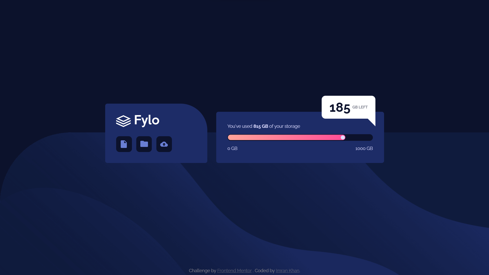

# Frontend Mentor - Fylo data storage component solution

This is a solution to the [Fylo data storage component challenge on Frontend Mentor](https://www.frontendmentor.io/challenges/fylo-data-storage-component-1dZPRbV5n). Frontend Mentor challenges help you improve your coding skills by building realistic projects.

## Table of contents

- [Overview](#overview)
  - [The challenge](#the-challenge)
  - [Screenshot](#screenshot)
  - [Links](#links)
- [My process](#my-process)
  - [Built with](#built-with)
  - [What I learned](#what-i-learned)
  - [Useful resources](#useful-resources)
- [Author](#author)

## Overview

### The challenge

Users should be able to:

- View the optimal layout for the site depending on their device's screen size

### Screenshot

### Links

- [Solution](./)
- [Live Site](https://astr0n0mer.github.io/challenges-frontendmentor.io/fylo-data-storage-component/index.html)

## My process

### Built with

- Semantic HTML5 markup
- CSS custom properties
- Flexbox
- Mobile-first workflow

### What I learned

- Had some hands on experience with `position` property in CSS
- Used relative and absolute positions for some elements
- Used `::after` pseudo element for adding an element in the DOM

### Useful resources

- [CSS Positioning: Position absolute and relative explained](https://www.youtube.com/watch?v=P6UgYq3J3Qs) by [Kevin Powell](https://www.youtube.com/@KevinPowell)
- [Learn CSS Position In 9 Minutes](https://www.youtube.com/watch?v=jx5jmI0UlXU) by [Web Dev Simplified](https://www.youtube.com/@WebDevSimplified)

## Author

- Github - [astr0n0mer](https://www.github.com/astr0n0mer)
- Frontend Mentor - [@astr0n0mer](https://www.frontendmentor.io/profile/astr0n0mer)
- Twitter - [@astronomer404](https://www.twitter.com/astronomer404)
