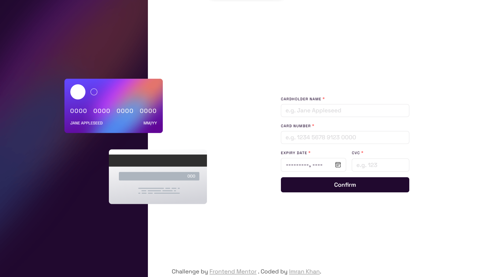

# Frontend Mentor - Interactive card details form solution

This is a solution to the [Interactive card details form challenge on Frontend Mentor](https://www.frontendmentor.io/challenges/interactive-card-details-form-XpS8cKZDWw). Frontend Mentor challenges help you improve your coding skills by building realistic projects.

## Table of contents

- [Overview](#overview)
  - [The challenge](#the-challenge)
  - [Screenshot](#screenshot)
  - [Links](#links)
- [My process](#my-process)
  - [Built with](#built-with)
  - [What I learned](#what-i-learned)
  - [Useful resources](#useful-resources)
- [Author](#author)

## Overview

### The challenge

Users should be able to:

- Fill in the form and see the card details update in real-time
- Receive error messages when the form is submitted if:
  - Any input field is empty
  - The card number, expiry date, or CVC fields are in the wrong format
- View the optimal layout depending on their device's screen size
- See hover, active, and focus states for interactive elements on the page

### Screenshot

| Mobile                       | Desktop                       |
| ---------------------------- | ----------------------------- |
|  |  |

### Links

- [Solution](./)
- [Live Site](https://astr0n0mer.github.io/challenges-frontendmentor.io/interactive-card-details-form/index.html)

## My process

### Built with

- Semantic HTML5 markup
- SCSS
- CSS custom properties
- Flexbox
- CSS Grid
- Mobile-first workflow

### What I learned

- Got familiar with `<input type="month"/>` for taking month and year inputs
- Worked for the first time on client side validation
- Got to implement image borders using the following CSS code:
  ```CSS
  border-color: transparent;
  background-image: linear-gradient(
      hsl(0, 0%, 100%),
      hsl(0, 0%, 100%)
    ),
    linear-gradient(
      to right,
      hsl(249, 99%, 64%),
      hsl(278, 94%, 30%)
    );
  background-origin: border-box;
  background-clip: padding-box, border-box;
  ```

### Useful resources

- [Code rounded gradient borders with CSS [no pseudo elements]](https://www.youtube.com/watch?v=k-kyiUuRxkQ)

## Author

- Portfolio - [Imran Khan](https://imrank.vercel.app/)
- Github - [astr0n0mer](https://www.github.com/astr0n0mer)
- Frontend Mentor - [astr0n0mer](https://www.frontendmentor.io/profile/astr0n0mer)
- Twitter - [imrank404](https://www.twitter.com/imrank404)
