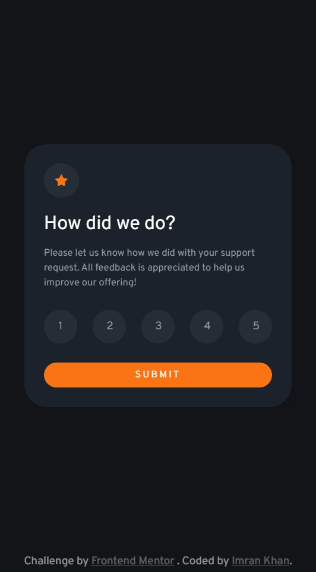
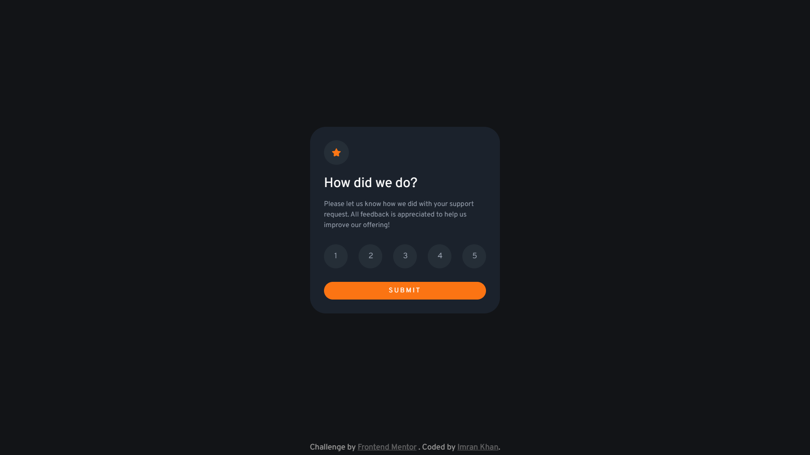

# Frontend Mentor - Interactive rating component solution

This is a solution to the [Interactive rating component challenge on Frontend Mentor](https://www.frontendmentor.io/challenges/interactive-rating-component-koxpeBUmI). Frontend Mentor challenges help you improve your coding skills by building realistic projects.

## Table of contents

- [Overview](#overview)
  - [The challenge](#the-challenge)
  - [Screenshot](#screenshot)
  - [Links](#links)
- [My process](#my-process)
  - [Built with](#built-with)
  - [What I learned](#what-i-learned)
- [Author](#author)

## Overview

### The challenge

Users should be able to:

- View the optimal layout for the app depending on their device's screen size
- See hover states for all interactive elements on the page
- Select and submit a number rating
- See the "Thank you" card state after submitting a rating

### Screenshot

| Mobile                       | Desktop                       |
| ---------------------------- | ----------------------------- |
|  |  |

### Links

- [Solution](./)
- [Live Site](https://astr0n0mer.github.io/challenges-frontendmentor.io/interactive-rating-component/index.html)

## My process

### Built with

- Semantic HTML5 markup
- CSS custom properties
- Flexbox
- Mobile-first workflow

### What I learned

- Learned the interaction of HTML elements with some modifier CSS classes using JS

## Author

- Portfolio - [Imran Khan](https://imrank.vercel.app/)
- Github - [astr0n0mer](https://www.github.com/astr0n0mer)
- Frontend Mentor - [astr0n0mer](https://www.frontendmentor.io/profile/astr0n0mer)
- Twitter - [imrank404](https://www.twitter.com/imrank404)
