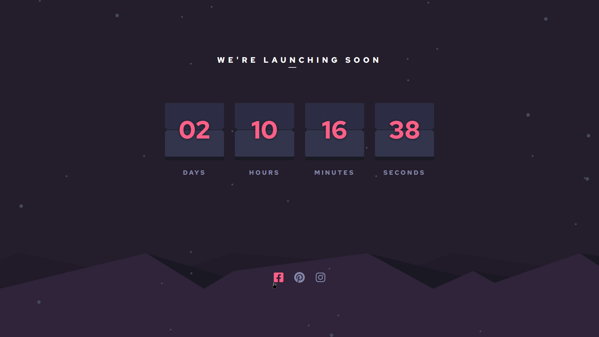

# Frontend Mentor - Launch countdown timer solution

This is a solution to the [Launch countdown timer challenge on Frontend Mentor](https://www.frontendmentor.io/challenges/launch-countdown-timer-N0XkGfyz-). Frontend Mentor challenges help you improve your coding skills by building realistic projects.

## Table of contents

- [Overview](#overview)
  - [The challenge](#the-challenge)
  - [Screenshot](#screenshot)
  - [Links](#links)
- [My process](#my-process)
  - [Built with](#built-with)
  - [What I learned](#what-i-learned)
  - [Continued development](#continued-development)
- [Author](#author)

## Overview

### The challenge

Users should be able to:

- See hover states for all interactive elements on the page
- See a live countdown timer that ticks down every second (start the count at 14 days)
- **Bonus**: When a number changes, make the card flip from the middle

### Screenshot

| Mobile                              | Desktop                              |
| ----------------------------------- | ------------------------------------ |
|  |  |

### Links

- [Solution](./)
- [Live Site](https://astr0n0mer.github.io/challenges-frontendmentor.io/launch-countdown-timer/dist/index.html)

## My process

### Built with

- [Vite](https://vitejs.dev/)
- [React](https://react.dev/)
- [Styled Components](https://styled-components.com/)
- Semantic HTML5 markup
- Flexbox
- CSS Grid
- Mobile-first workflow

### What I learned

- Learned about the usage of two new React Hooks
  - [useEffect()](https://react.dev/reference/react/useEffect)
  - [useRef()](https://react.dev/reference/react/useRef)

### Continued development

- Need to learn 3D effects in CSS to increase the interactions in my projects.

## Author

- Portfolio - [Imran Khan](https://imrank.vercel.app/)
- GitHub - [astr0n0mer](https://www.github.com/astr0n0mer)
- Frontend Mentor - [astr0n0mer](https://www.frontendmentor.io/profile/astr0n0mer)
- Twitter - [imrank404](https://www.twitter.com/imrank404)
