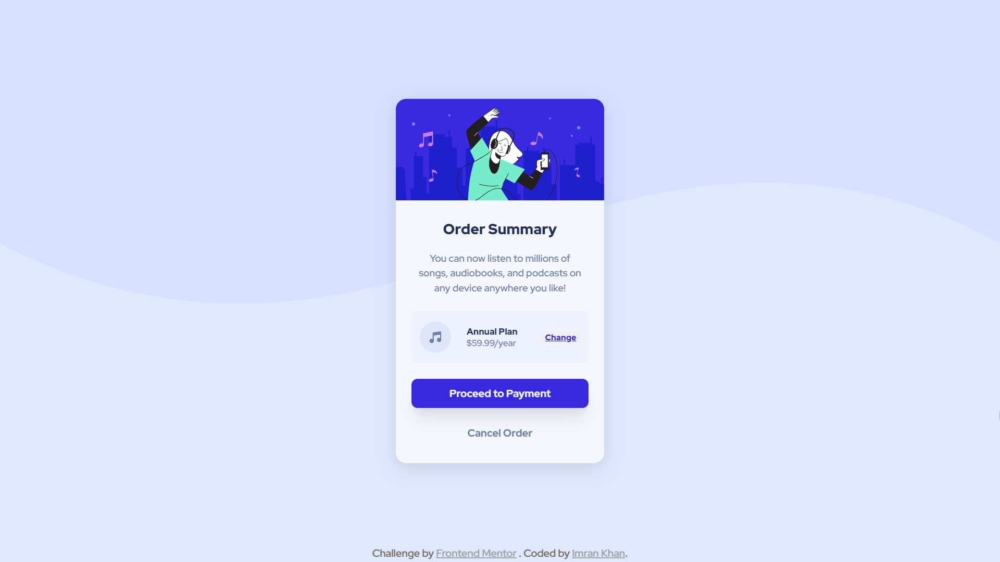

# Frontend Mentor - Order summary card solution

This is a solution to the [Order summary card challenge on Frontend Mentor](https://www.frontendmentor.io/challenges/order-summary-component-QlPmajDUj). Frontend Mentor challenges help you improve your coding skills by building realistic projects.

## Table of contents

- [Overview](#overview)
  - [The challenge](#the-challenge)
  - [Screenshot](#screenshot)
  - [Links](#links)
- [My process](#my-process)
  - [Built with](#built-with)
  - [What I learned](#what-i-learned)
  - [Continued development](#continued-development)
- [Author](#author)

## Overview

### The challenge

Users should be able to:

- See hover states for interactive elements

### Screenshot

| Mobile                       | Desktop                       |
| ---------------------------- | ----------------------------- |
|  |  |

### Links

- [Solution](./)
- [Live Site](https://astr0n0mer.github.io/challenges-frontendmentor.io/order-summary-component/index.html)

## My process

### Built with

- Semantic HTML5 markup
- CSS custom properties
- Flexbox
- Mobile-first workflow

### What I learned

- Extensively used Flexbox for implementing the smaller parts of the summary card component

### Continued development

- I feel I used too much code for implementing a relatively simple card component
- I would really love some feedback on areas that I can improve

## Author

- Portfolio - [Imran Khan](https://imrank.vercel.app/)
- Github - [astr0n0mer](https://www.github.com/astr0n0mer)
- Frontend Mentor - [astr0n0mer](https://www.frontendmentor.io/profile/astr0n0mer)
- Twitter - [imrank404](https://www.twitter.com/imrank404)
