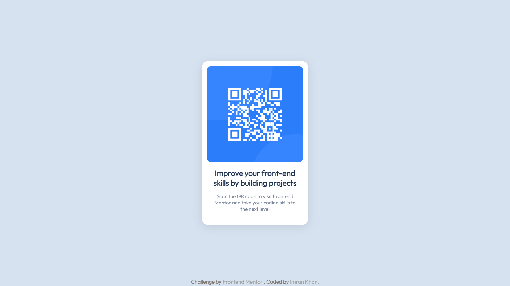

# Frontend Mentor - QR code component solution

This is a solution to the [QR code component challenge on Frontend Mentor](https://www.frontendmentor.io/challenges/qr-code-component-iux_sIO_H). Frontend Mentor challenges help you improve your coding skills by building realistic projects.

## Table of contents

- [Overview](#overview)
  - [Screenshot](#screenshot)
  - [Links](#links)
- [My process](#my-process)
  - [Built with](#built-with)
  - [What I learned](#what-i-learned)
  - [Continued development](#continued-development)
  - [Useful resources](#useful-resources)
- [Author](#author)

## Overview

### Screenshot

| Mobile                       | Desktop                       |
| ---------------------------- | ----------------------------- |
|  |  |

### Links

- [Solution](./)
- [Live Site](https://astr0n0mer.github.io/challenges-frontendmentor.io/qr-code-component/index.html)

## My process

### Built with

- Semantic HTML5 markup
- CSS custom properties
- Flexbox

### What I learned

- Started using BEM notation for CSS
- Gaining confidence in my HTML & CSS skills to build responsive layouts

### Continued development

- Need to practice more of Flexbox and Grid
- Then move on working with media queries

### Useful resources

- [Conquering Responsive Layouts](https://courses.kevinpowell.co/view/courses/conquering-responsive-layouts)
  - This course helped me clear out the concepts with absolute (_px_) and relative (_%_, _em_ and _rem_) units in CSS.
  - Really great for people that have a little background with CSS, let's say from [w3schools](https://www.w3schools.com/).

## Author

- Github - [astr0n0mer](https://www.github.com/astr0n0mer)
- Frontend Mentor - [@astr0n0mer](https://www.frontendmentor.io/profile/astr0n0mer)
- Twitter - [@astronomer404](https://www.twitter.com/astronomer404)
